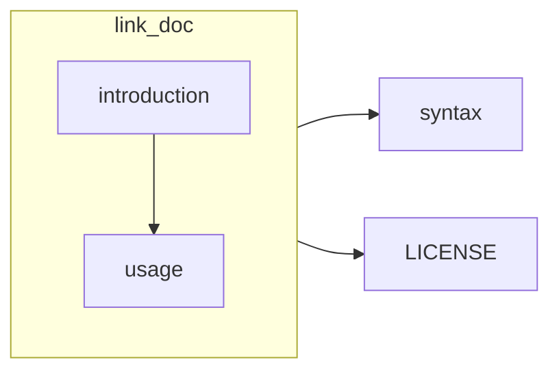

# link_doc

```mermaid
flowchart LR
  subgraph link_doc
    direction TB
    introduction --> usage
  end
  link_doc --> syntax
  link_doc --> LICENSE

  click LICENSE "https://github.com/wanabe/link_doc/tree/main/docs/link_doc/LICENSE"
  click introduction "https://github.com/wanabe/link_doc/tree/main/docs/link_doc/README.md#introduction"
  click syntax "https://github.com/wanabe/link_doc/tree/main/docs/link_doc/syntax.md"
  click usage "https://github.com/wanabe/link_doc/tree/main/docs/link_doc/README.md#usage"
```

## introduction

## usage